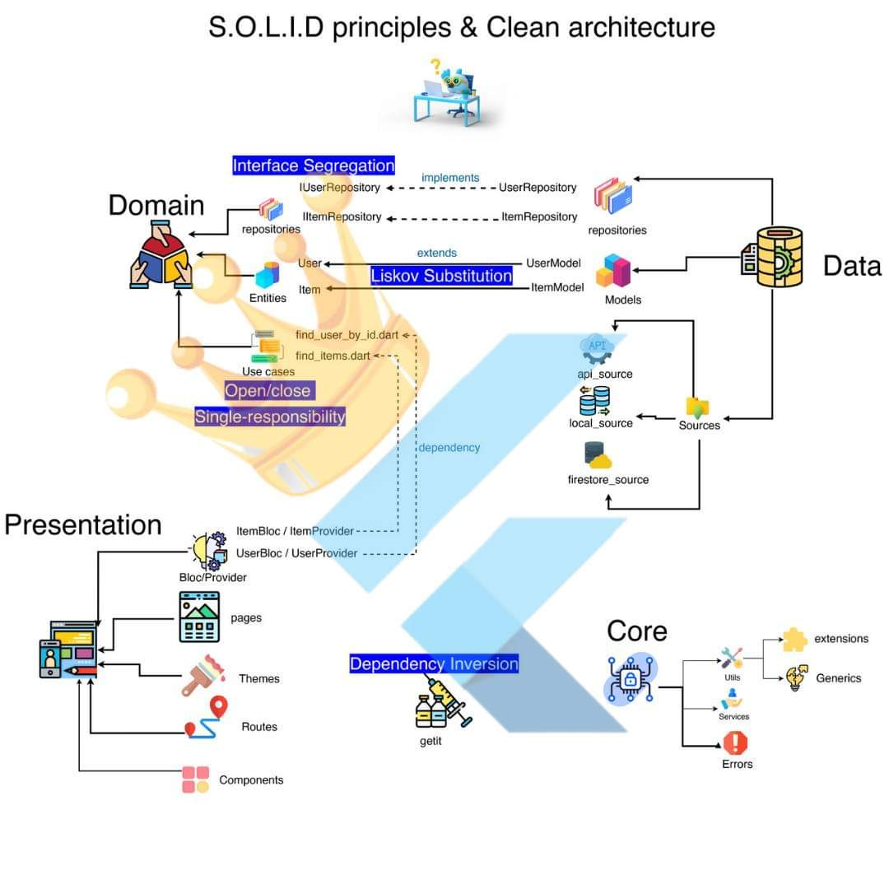

# Movies applicacion

This application uses TheMovieDB API to display, filter, search, add to favorites, view movie details among other functions, this application uses Riverpod as a state manager, and principles of Clean Architecture, Clean code and SOLID.

## Concepts of architecture

<table>
  <tr>
    <td align="center" valign="center"></td>
  </tr>
 </table>

### Entities
Este concepto nos ayude a definir las reglas de negocio. Hay que tener en cuenta que las entidades son atómicas. Podemos pensar en entidades como objetos que son y serán idénticos entre diferentes aplicaciones de nuestra empresa. Por ejemplo, clientes, productos, películas.

### Datasources
En pocas palabras, un Datasource es la fuente de datos. No debería importar de donde venga la información. Los datasources abstractos definen las reglas de negocio que se deben seguir, mientras que las implementaciones como tal, es en donde se llama al API.

### Repositories
Son los encargados de invocar a los datasources. Deben ser flexibles para poder cambiarlos en cualquier momento, sin afectar a la aplicación.

### State manager
Sirve de puente entre nuestros casos de uso (repository) y realizan los cambios visuales en los Widgets. El gestor de estado es el encargado de invocar a los casos de uso, y estos al repositorio.

## Android platform overview

- Minimum supported version: Android version 5.0 Lollipop (Api level 21)
- Application Identifier (applicationId) **com.example.flutter_movies_app**

## Get Started 🚀

- Depending on the platform (Windows / MacOS) install Flutter in the stable version `3.10.0`
- In case of using different versions of Flutter, it is recommended to install and use the Flutter [FVM version manager](https://fvm.app/).

```
git clone https://github.com/baguilar6174/flutter-movies-app.git
```

1. Run `flutter pub get` in project root
2. Copy `.env.template` after that, rename this file to `.env`
3. Complete the environment variables
  - This project uses TheMovieDB API, you can read the [documentation to create an API Key](https://developer.themoviedb.org/docs/getting-started)
4. Run `flutter run`

## Packages used

* `go_router: ^6.0.5` Routes management
* `flutter_dotenv: ^5.0.2` Use environment variables

## What I learned

- Datasources
- Repositories
- Models
- Entities
- Riverpod
  - Provider
  - StateNotifierProvider
  - Notifiers
- Mappers

## Autor

- Website - [www.bryan-aguilar.com](https://www.bryan-aguilar.com/)
- Medium - [baguilar6174](https://baguilar6174.medium.com/)
- LinkeIn - [baguilar6174](https://www.linkedin.com/in/baguilar6174)
- Email - [bryan.aguilar6174@gmail.com](mailto:bryan.aguilar6174@gmail.com)